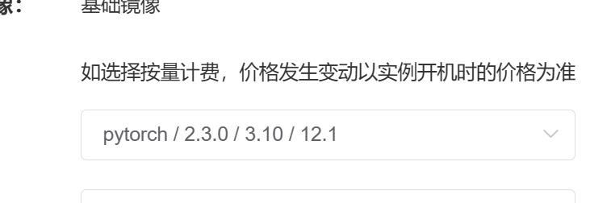

---
title: jupyter
date: 2024-06-21 22:26:04
modificationDate: 2024 六月 23日 星期日 18:27:32
categories: 
	- Python
tags: []
sticky: []
hide: false
category_bar: true
---

## 安装
pip install notebook


用于启动 Jupyter Notebook 服务的一系列命令


```sh
jupyter-notebook stop 8888
JUPYTER_TOKEN=$(< /dev/urandom tr -dc A-Za-z0-9 | head -c16; echo)
echo $JUPYTER_TOKEN
nohup jupyter-notebook --ip 0.0.0.0 --port 8888 --no-browser --allow-root --NotebookApp.token=$JUPYTER_TOKEN &
jupyter-notebook list
```

这里是每条命令的简要说明：

```
jupyter-notebook stop 8888：停止端口为 8888 的 Jupyter Notebook 服务。
JUPYTER_TOKEN=$(< /dev/urandom tr -dc A-Za-z0-9 | head -c16; echo)：生成一个随机的 16 位的 token，用于 Jupyter Notebook 的安全认证。
nohup jupyter-notebook --ip 0.0.0.0 --port 8888 --no-browser --allow-root --NotebookApp.token=$JUPYTER_TOKEN &：在后台启动 Jupyter Notebook 服务，允许从任何 IP 地址访问，不打开浏览器，允许 root 用户运行，并设置之前生成的 token。
jupyter-notebook list：列出当前运行的 Jupyter Notebook 服务。

```

# conda　对应版本

```sh
conda install pytorch==1.7.1 torchvision==0.8.2 torchaudio==0.7.2 cudatoolkit=11.0 -c pytorch
```

[PyTorch](https://pytorch.org/)


```sh

conda install python=3.10 pytorch torchvision torchaudio pytorch-cuda=12.1 -c pytorch -c nvidia
```

指定python版本：

conda install python=3.10 pytorch=2.3.0 torchvision torchaudio pytorch-cuda=12.1 -c pytorch -c nvidia