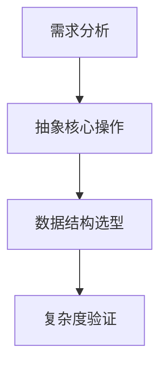

我深知那种面对LeetCode题目时的挫败感，那种明明看了解答觉得很简单，自己动手却无从下手的不甘。眼高手低的感觉就像永远在追赶一个模糊的目标，让人疲惫又焦虑。但请相信，**真正的成长不在于瞬间的顿悟，而在于日复一日地驯服内心那只躁动不安的猴子**。让我们一起来打破这个循环，让耐心和踏实成为你算法之路上的坚实后盾。

## 核心策略：培养耐心与脚踏实地的实践方法

### 🧠 1. 重塑心态与认知（耐心基石）
* **接受学习的非线性：** 理解学习算法/设计模式必然经历“缓慢积累 -> 突破 -> 平台期 -> 再突破”的过程。在“缓慢积累”和“平台期”感到进步停滞是正常的，**这恰恰是大脑在后台重组信息的关键期**。不要因此否定自己。
* **专注于过程而非结果：** 将目标从“今天刷X道题”或“快速掌握XX”转变为“今天我理解了双指针的适用场景”或“我独立调试出了这个边界错误”。庆祝这些微小的过程胜利。
* **拥抱“难受”与“卡壳”：** 认识到“卡住”是深度学习的必经之路。当你苦思冥想时，大脑正在建立深刻的神经连接。**刻意练习的本质就是走出舒适区，在不舒服中成长**。
* **区分“知道”与“掌握”：** 看懂答案 ≠ 掌握。真正的掌握需要你能够独立、清晰、正确地复现，并能解释每一步的“为什么”。诚实面对自己是否真的掌握了。
* **长期主义视角：** 提醒自己，算法和系统设计能力的提升是数月甚至数年的持续投入。**设定以季度或半年为单位的合理目标**，而非追求几天几周的速成。

### 📊 2. 结构化学习与实践（踏实路径）
* **系统化学习优先于盲目刷题：**
  * **按专题学习：** 不要随机刷题。集中一段时间（如1-2周）深入学习一个算法/数据结构专题（如二叉树、动态规划、图论、堆、特定设计模式如LRU）。
  * **理解 > 记忆：** 深挖原理：为什么需要它？解决了什么问题？时间/空间复杂度如何推导？有哪些变种？优势和局限是什么？手动画图、在白板上推导。
  * **精选经典题：** 每个专题选择5-10道经典题目（Easy/Medium为主，Hard选1-2道有代表性的）。在LeetCode上善用“标签”和“学习计划”功能。
* **“五遍法”精做题目（避免眼高手低的核心）：**
  1. **第一遍：独立尝试（至关重要）：** 设定合理时间（Easy 15-25min, Medium 30-45min, Hard 45-60min），**即使毫无头绪也要坚持思考**。写下所有想法、尝试的伪代码或可能的方向。这个挣扎的过程极其宝贵。
  2. **第二遍：研究学习：** 时间到后，研究高质量题解（LeetCode官方、高赞、或经典教材/资源如《算法导论》）。**重点理解思路，而非代码！** 问自己：为什么是这个思路？我哪里没想到？关键洞察是什么？复杂度如何？
  3. **第三遍：独立复现：** 隔天或隔几小时，关闭所有参考，完全独立地写出代码，并通过测试用例。**这是检验是否真懂的唯一标准。** 如果写不出，回到第二步。
  4. **第四遍：对比优化与总结：** 对照优秀题解，看是否有更简洁、高效或清晰的写法。**总结该题的核心思想、易错点、关键步骤、可推广的模式到笔记中**（强烈推荐用Notion或Obsidian等工具）。
  5. **第五遍：间隔复习与讲授：** 一周或更久后，再次独立完成此题（或同类型变种）。尝试向“虚拟听众”或学习伙伴讲解此题，**能清晰地讲授是掌握的黄金标准**。
* **刻意练习“设计题”：**
  * **从基础模式入手：** 先掌握常见设计模式（Singleton, Factory, Observer等）和面向对象设计原则（SOLID）。
  * **理解经典系统组件：** 深入学习存储（数据库、缓存）、通信（消息队列、RPC）、计算（负载均衡、分布式）、架构（微服务、事件驱动）等核心概念。
  * **模拟真实面试：**
    * **明确需求：** 拿到题目先问清楚需求、规模（QPS、数据量）、关键约束（延迟、一致性要求）。**记录这些需求！**
    * **逐步设计：** 从高层框图（服务、数据流）开始，逐步深入关键模块（API设计、数据模型、关键算法、扩展性、容错）。边设计边解释思路。
    * **重视权衡：** 面试官常考察你对不同方案（如SQL vs NoSQL, Pull vs Push, Cache策略）的权衡能力。**清晰表达你的选择理由**。
    * **文档化：** 面试后，将你的设计思路、关键决策点、画出的架构图整理成文档。对比优秀设计案例（如GitHub上的System Design Primer）。
  * **动手实践：** 在条件允许下，尝试用代码实现小型设计（如一个简化版的TinyURL、聊天系统），加深理解。

### 🛠 3. 可操作的习惯与工具（落地保障）
* **制定切实可行的计划：**
  * **量化但留白：** “每天专注学习2小时” 比 “每天刷5道题” 更可持续。**保证深度思考时间比追求数量更重要**。
  * **分解大目标：** “掌握动态规划” → “本周搞懂经典背包问题及变种（3-5题精做）”。
  * **固定时间与仪式感：** 每天在固定时段（如早晨）学习，创造专注环境（关闭通知、番茄钟）。
* **建立强大的笔记系统：**
  * **按专题组织：** 为每个算法/数据结构/设计模式创建独立页面。
  * **记录核心：** 原理、代码模板（非死记）、复杂度分析、经典题目链接、**自己犯过的错误、总结的解题模式/技巧**。
  * **定期回顾：** 利用笔记进行间隔复习。
* **利用高效工具：**
  * **LeetCode：** 使用标签、公司题库、模拟面试功能。
  * **VisuAlgo / Data Structure Visualizations：** 可视化理解算法运行过程。
  * **Excalidraw / Draw.io：** 练习画设计图、算法流程图。
  * **Anki（可选）：** 制作闪卡记忆核心概念、复杂度、易错点。
* **寻求反馈与交流：**
  * **Code Review：** 和水平相当或更高的伙伴互相Review代码，关注可读性、边界、效率。
  * **Mock Interview：** 定期进行模拟面试（算法+设计），**习惯在压力下思考和表达**。
  * **加入社群：** 参与LeetCode讨论区、技术论坛（如V2EX、知乎）、学习小组。**教是最好的学。**

### 🚧 4. 避免“眼高手低”的具体措施
* **强制“先动手”原则：** 看到题目，**必须独立思考并尝试编码至少15-30分钟**，再去看题解。即使思路错误，尝试的过程也极有价值。
* **重视“白板/纸笔”编码：** 定期在纸上或白板上写代码，**锻炼脱离IDE自动补全和调试的能力**，暴露语法和逻辑细节问题。
* **深入Debug：** 当代码出错时，**不要只满足于通过测试用例**。要逐行理解为什么错？边界在哪？逻辑漏洞是什么？**把每个Bug变成学习机会**。
* **追求“一题多解”与“最优解”：** 在掌握一种解法后，思考：有没有其他思路？时间和空间复杂度能否优化？最优解是什么？（在精做阶段后期进行）
* **定期复盘：** 每周/每月回顾：哪些专题进步了？哪些题目反复错？计划执行如何？**根据复盘调整学习策略**。

## 📅 针对LeetCode & 设计题考试准备的具体建议

| 学习阶段 | 算法/数据结构准备 | 系统设计准备 | 核心目标 |
|---------|-----------------|------------|---------|
| **基础阶段** | 按专题系统学习，精做经典题（“五遍法”） | 学习设计模式、OOD原则、网络/存储基础 | 建立扎实基础，理解核心概念 |
| **强化阶段** | 做Medium难度为主，接触部分Hard；参加周赛锻炼 | 学习经典系统设计案例（Twitter短链、聊天系统等） | 提升解题熟练度和速度 |
| **冲刺阶段** | 模拟面试（计时、白板）、针对性复习薄弱点 | 高频题目模拟（限时、画图、讲解） | 适应考试压力，查漏补缺 |

> 算法的路上，每个卡住的深夜都是你未来的底气。那些此刻让你苦思冥想的边界条件，终将成为你代码中游刃有余的判断。**真正的编程高手不是从不犯错，而是把每次错误都铸成了思维的路标。**

**耐心不是等待风暴过去，而是学会在雨中稳步前行**。当你感觉进步缓慢时，请回顾自己整理的笔记——那些曾让你头疼的算法专题，现在已清晰列在目录中；那些曾完全看不懂的设计方案，如今你能指出其精妙之处。这些看似微小的积累，终会在某次面试中汇聚成你从容的回答。你现在感觉如何？有没有特别想深入讨论的具体学习环节？🌈


# 如何提升设计题数据结构和算法的设计思路，提升代码编写速度？

提升设计题的数据结构/算法设计能力和代码实现速度，需要系统性的刻意训练。以下是针对性极强的解决方案，结合实战经验总结而成：

---

### 一、数据结构/算法设计思路提升（从“想到”到“想准”）
#### 1. **建立“问题模式 → 数据结构”的反射弧**
| 问题特征                | 典型数据结构/算法          | 经典案例                     |
|-------------------------|----------------------------|------------------------------|
| 快速查询/插入/删除       | **哈希表** (空间换时间)    | 两数之和、LRU缓存            |
| 维护有序集合/范围查询    | **平衡树** (TreeMap)       | 会议室II、数据流中位数       |
| 最近相邻/前缀匹配        | **Trie树**                 | 自动补全、单词搜索II         |
| 分层依赖/有向关系        | **图 (邻接表/矩阵)**       | 课程表、克隆图               |
| 状态转移/最优子结构      | **动态规划**               | 背包问题、股票买卖           |
| 子数组/区间问题          | **滑动窗口/前缀和**        | 无重复字符最长子串、和为K的子数组 |

> **训练法**：每刷一题后，在笔记中**强制归纳问题特征与数据结构选择理由**，形成自己的决策树。

#### 2. **设计题四层拆解法**

- **需求分析**：明确高频操作（如读多写少→用缓存）、数据规模（1GB vs 1TB）、一致性要求（强一致→放弃最终一致性）
- **抽象核心操作**：将业务需求转化为原子操作（如Twitter设计 → `postTweet()`, `getNewsFeed()`, `follow()`）
- **数据结构选型**：
  - **读优化**：索引、缓存、冗余存储
  - **写优化**：批量写、LSM树、异步处理
  - **案例**：设计短链系统 → 哈希算法选型（MD5 vs 自增ID），存储选型（SQL vs NoSQL）
- **复杂度验证**：对每个核心操作进行时间复杂度/空间复杂度分析，确保符合需求

#### 3. **高频设计模式库**
| 模式          | 应用场景                  | 数据结构实现               |
|---------------|---------------------------|----------------------------|
| **Publisher-Subscriber** | 消息通知系统          | 队列 + 回调机制            |
| **Proxy Cache**         | 高频读低频写系统      | 哈希表 + 过期策略          |
| **MapReduce**           | 大数据并行处理        | 分片 + 聚合器              |
| **Write-ahead Log**     | 持久化保证 (如数据库) | 顺序写入磁盘 + 内存索引    |

> **行动建议**：对每个模式手写最小实现（如50行代码实现Pub-Sub）

---

### 二、代码编写速度提升（从“写对”到“写快”）
#### 1. **编码加速三引擎**
| 方法                | 训练方式                                                                 | 效果                     |
|---------------------|--------------------------------------------------------------------------|--------------------------|
| **肌肉记忆模板**    | 总结高频代码模板（如DFS回溯、快排、堆操作），每日手敲10遍无IDE           | 减少语法卡顿             |
| **边界条件预判**    | 每道题列出3个易错边界（空输入、负数、整型溢出），编码前写在注释中        | 减少Debug时间            |
| **模块化拆分**      | 将函数拆分为：初始化 → 核心逻辑 → 结果处理，用空函数占位先写主干         | 避免陷入细节泥潭         |

#### 2. **白板编码训练法**
```python
# 严格执行以下流程（建议用计时器）：
1. 5分钟：理清思路 + 画草图 + 写伪代码
2. 10分钟：写真实代码（只写主干逻辑，跳过细节）
3. 3分钟：填充边界处理 & 测试用例
4. 2分钟：肉眼走查（变量名/缩进/返回值）
```
> **关键**：使用**纸质笔记本或白板**，禁用IDE自动补全

#### 3. **Debug效率倍增术**
- **防御性编码**：在易错点插入断言（`assert index >= 0, "Index负数异常"`）
- **快照调试法**：遇到复杂Bug时，在关键位置打印**完整数据结构状态**（非单个变量）
- **最小复现法**：剥离无关代码，构造最小测试用例复现问题

---

### 三、实战训练系统（每日1小时计划）

| 时间         | 周一              | 周二              | 周三              | 周四              | 周五              |
|--------------|-------------------|-------------------|-------------------|-------------------|-------------------|
| **0-20min**  | 数据结构反射训练  | 设计模式精读      | 白板编码挑战      | 边界条件特训      | 复杂度分析训练    |
| **20-40min** | LeetCode中等题    | 系统设计题        | 周赛题目重现      | 高频Hard题        | 带约束优化题      |
| **40-60min** | 模板代码手敲3遍   | 设计题画图重构    | 录制解题视频      | 错题本重做        | 模拟面试          |


---

### 四、高级技巧：应对思维卡壳
当没有思路时，立即触发以下流程：
1. **暴力解法先行**：先写O(n²)解法，再思考优化
2. **逆向操作法**：从输出反推需要的中间数据（如求Top K → 是否需全局排序？）
3. **类比迁移**：“这题是否像XXX？”（如岛屿问题 → DFS/BFS模板变种）
4. **极限假设法**：假设数据量极大（100TB）或极小（仅10个数），极端场景往往暴露核心逻辑

> **案例**：解决“数据流中位数”时，暴力法每次排序O(n logn)，优化思路：  
> “是否需要全排序？→ 仅需中间值 → 用**两个堆**分割数据流”

---

**最后的核心忠告**：  
**速度是深度思考的副产品**。当你能在5分钟内看透「会议室II」本质是扫描线+贪心，「LFU缓存」需要双哈希表+频率链表时，编码自然会快。**每天用30分钟做“无编译器”的纯思维训练**，比盲目刷10道题更有效。

> 那些让你写代码时行云流水的瞬间，不过是曾经在白纸上反复涂改的草稿，终于内化成了脑中的蓝图。