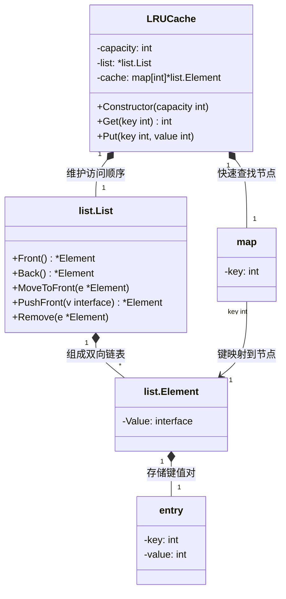

举个简单的例子：
**设计题 - 实现浏览器历史记录** 
1.初始化 homepage 和历史记录容量 
2.浏览网页 
   - 和当前页相同，则直接返回
   - 和当前页不同，如果容量满了，则删除最早的记录；清楚之前当前页的后边的历史记录，并把最新的当前页添加到最后。
3.实现前进和后退功能
```go
/*
 * Copyright (c) 2023 Lei Qi. All rights reserved.
 * Author: Lei Qi
 * Description: 浏览器实现
 * Date: 2023/10/10 上午12:33
 */

package main

import (
	"container/list"
	"fmt"
)

type Browser struct {
	history  *list.List
	current  *list.Element
	maxLen   int
	homepage string
}

func NewBrowser(maxLen int, homepage string) *Browser {
	history := list.New()
	current := history.PushBack(homepage)
	return &Browser{
		history:  history,
		current:  current,
		maxLen:   maxLen,
		homepage: homepage,
	}
}

func (b *Browser) GetCurrentPage() string {
	return b.current.Value.(string)
}

func (b *Browser) GoBack() string {
	if b.current.Prev() != nil {
		b.current = b.current.Prev()
	}
	return b.GetCurrentPage()
}

func (b *Browser) GoForward() string {
	if b.current.Next() != nil {
		b.current = b.current.Next()
	}
	return b.GetCurrentPage()
}

func (b *Browser) NavigateToNewPage(newPageURL string) string {
	if b.GetCurrentPage() == newPageURL {
		return newPageURL
	}
	
	// 清除当前页面之后的历史记录
	for e := b.current.Next(); e != nil; e = e.Next() {
		b.history.Remove(e)
	}
	// 将新页面添加到历史记录中
	b.current = b.history.InsertAfter(newPageURL, b.current)
	// 限制浏览器历史记录的最大长度
	for b.history.Len() > b.maxLen {
		front := b.history.Front()
		if front != nil {
			b.history.Remove(front)
		}
	}
	return b.GetCurrentPage()
}

func main() {
	browser := NewBrowser(5, "初始页面")

	fmt.Println("当前页面:", browser.GetCurrentPage())

	// 浏览新页面
	fmt.Println("浏览新页面:", browser.NavigateToNewPage("新页面1"))
	fmt.Println("当前页面:", browser.GetCurrentPage())

	// 浏览更多新页面
	fmt.Println("浏览新页面:", browser.NavigateToNewPage("新页面2"))
	fmt.Println("浏览新页面:", browser.NavigateToNewPage("新页面3"))
	fmt.Println("浏览新页面:", browser.NavigateToNewPage("新页面4"))
	fmt.Println("浏览新页面:", browser.NavigateToNewPage("新页面5"))
	fmt.Println("当前页面:", browser.GetCurrentPage())

	// 后退和前进
	fmt.Println("后退:", browser.GoBack())
	fmt.Println("后退:", browser.GoBack())
	fmt.Println("前进:", browser.GoForward())
}
```

当面临一个设计题，如实现一个浏览器历史记录，需要考虑许多方面的因素。在这篇博客中，我们将探讨如何思考、建模和解决这个设计题，以及如何在考试场景下应对这类问题。

# 第一步：理解需求
在着手解决设计题之前，首先要明确需求。在这个例子中，我们需要实现一个浏览器历史记录，包括以下功能：

记录当前页面。
支持前进和后退操作。
能够跳转到新页面。
考虑历史记录的容量限制。
# 第二步：建模
接下来，我们需要建立一个合适的模型来表示浏览器历史记录。在这个模型中，需要考虑以下要素：

当前页面：表示用户当前正在浏览的页面。
历史记录：表示用户访问过的页面的顺序列表。
最大容量：限制历史记录的长度，以防止无限增长。
一个合适的数据结构来表示这个模型是双向链表。双向链表允许我们轻松插入、删除和遍历元素，非常适合表示浏览历史记录。

# 第三步：选择数据结构和函数
接下来，我们需要选择适当的数据结构来表示模型，并确定哪些函数将用于实现各种操作。在这个例子中，我们选择了container/list包中的双向链表作为数据结构，并定义以下函数：

NewBrowser(maxLen int, homepage string) *Browser：创建一个浏览器对象，并指定最大历史记录容量和首页。
GetCurrentPage() string：获取当前页面的URL。
GoBack() string：执行后退操作，并返回当前页面的URL。
GoForward() string：执行前进操作，并返回当前页面的URL。
NavigateToNewPage(newPageURL string) string：导航到新页面，并返回当前页面的URL。

# 第四步：编写示例代码
现在，我们可以编写示例代码来展示如何使用这个设计。在示例中，我们模拟了用户浏览不同页面的情况，并展示了如何使用上述函数来管理浏览历史记录。

# 第五步：测试和优化
一旦实现了设计，就需要进行测试以确保它能按预期工作。在测试过程中，需要考虑各种情况，包括正常操作、边界情况和错误情况。

根据测试的结果，可以对设计进行优化和改进。这可能包括性能优化、边界情况的处理、错误处理和异常情况的处理等。

# 总结
在解决一个设计题时，需要从需求出发，建立合适的模型，选择适当的数据结构和函数，编写示例代码，进行测试和优化。设计题通常涉及多个方面的考虑，需要综合考虑各种情况以确保设计的正确性和鲁棒性。

# 练习
下面，我们来按照难度多练习几道题目

# 简单题

1. [232. 用栈实现队列 - 力扣（LeetCode）](https://leetcode.cn/problems/implement-queue-using-stacks/description/)


 **思路：**input 作为输入，output 最为反转后的；如果output存在则直接取结果；否则从input里边反转；
```go
type MyQueue struct {
	inputStack  []int
	outputStack []int
}

func Constructor() MyQueue {
	return MyQueue{
		inputStack:  make([]int, 0),
		outputStack: make([]int, 0),
	}
}

func (this *MyQueue) Push(x int) {
	this.inputStack = append(this.inputStack, x)
}

func (this *MyQueue) Pop() int {
	if len(this.outputStack) != 0 {

		topTmp := this.outputStack[len(this.outputStack)-1] //
		this.outputStack = this.outputStack[:len(this.outputStack)-1]
		return topTmp
	} else {
		for len(this.inputStack) != 0 {
			this.outputStack = append(this.outputStack, this.inputStack[len(this.inputStack)-1])
			this.inputStack = this.inputStack[:len(this.inputStack)-1]
		}
	}

	top := this.outputStack[len(this.outputStack)-1] //
	this.outputStack = this.outputStack[:len(this.outputStack)-1]
	return top
}

func (this *MyQueue) Peek() int {
	if len(this.outputStack) != 0 {

		topTmp := this.outputStack[len(this.outputStack)-1] //
		return topTmp
	} else {
		for len(this.inputStack) != 0 {
			this.outputStack = append(this.outputStack, this.inputStack[len(this.inputStack)-1])
			this.inputStack = this.inputStack[:len(this.inputStack)-1]
		}
	}

	top := this.outputStack[len(this.outputStack)-1] //
	return top
}

func (this *MyQueue) Empty() bool {
	if len(this.inputStack) == 0 && len(this.outputStack) == 0 {
		return true
	}
	return false
}


/**
 * Your MyQueue object will be instantiated and called as such:
 * obj := Constructor();
 * obj.Push(x);
 * param_2 := obj.Pop();
 * param_3 := obj.Peek();
 * param_4 := obj.Empty();
 */

```

2. [225. 用队列实现栈 - 力扣（LeetCode）](https://leetcode.cn/problems/implement-stack-using-queues/description/)

**思路：**用队列实现栈；栈是最后一元素出来；所以input 需要遍历到添加元素到output, 到剩余最后一个元素。这个元素就是要出栈的。出完栈再将output 重新赋值给input;output 重置为空；

```go
type MyStack struct {
	inputQueue  []int
	outputQueue []int
}

func Constructor() MyStack {
	return MyStack{
		inputQueue:  make([]int, 0),
		outputQueue: make([]int, 0),
	}

}

func (this *MyStack) Push(x int) {
	this.inputQueue = append(this.inputQueue, x)

}

func (this *MyStack) Pop() int {
	for len(this.inputQueue) != 1 {
		this.outputQueue = append(this.outputQueue, this.inputQueue[0])
		this.inputQueue = this.inputQueue[1:]
	}
	top := this.inputQueue[0]
	this.inputQueue = this.outputQueue
    this.outputQueue = []int{}
	return top

}

func (this *MyStack) Top() int {
	for len(this.inputQueue) != 1 {
		this.outputQueue = append(this.outputQueue, this.inputQueue[0])
		this.inputQueue = this.inputQueue[1:]
	}
	top := this.inputQueue[0]
	this.inputQueue = append(this.outputQueue, this.inputQueue...)
    this.outputQueue = []int{}
	return top
}

func (this *MyStack) Empty() bool {
	if (len(this.inputQueue) == 0) && (len(this.outputQueue) == 0) {
		return true
	}
	return false
}

```


# [303. 区域和检索 - 数组不可变](https://leetcode.cn/problems/range-sum-query-immutable/)


思路：简单题，


```go
type NumArray struct {
    nums  []int
}


func Constructor(nums []int) NumArray {
    return NumArray{nums: nums}
}


func (this *NumArray) SumRange(left int, right int) int {
    sum := 0 
    for i:= left; i<= right; i++ {
        sum += this.nums[i]
    }
    return sum
}


/**
 * Your NumArray object will be instantiated and called as such:
 * obj := Constructor(nums);
 * param_1 := obj.SumRange(left,right);
 */

```

使用前缀和

怎么求 preSum 数组
利用前面提到的递推式:


遍历求出每一个preSum[i]，别忘了预置preSum[-1]为0，**即preSum[0]为nums[0]（前提是nums有元素）**。

预置preSum[-1]这种荒谬的情况，只是为了边界情况也能套用通式。

需要针对len(nums) == 0的情况进行特判，i = 0 的情况，也需单独讨论。

后面会给出简化的写法。
```go
type NumArray struct {
    preSum []int
}


func Constructor(nums []int) NumArray {
    preSum := make([]int, len(nums))
    preSum[0] = nums[0]
    for i:=1; i<len(nums);i++ {
        preSum[ i] = preSum[ i-1] + nums[i]
    }
    
    return NumArray{preSum}
}


func (this *NumArray) SumRange(left int, right int) int {
    	if left == 0 { // 此时preSum[i-1]应该为0，从0到j的求和，应该返回preSum[j]
		if len(this.preSum) == 0 { // 但如果nums根本没有长度，直接返回0
			return 0
		}
		return this.preSum[right]
	}
    return this.preSum[right] - this.preSum[left-1]
}


/**
 * Your NumArray object will be instantiated and called as such:
 * obj := Constructor(nums);
 * param_1 := obj.SumRange(left,right);
 */

```

使用多一位长度的前缀和
之所以上面处理东西多，是因为`preSum[i]`的定义导致的。例如如果上边left == 0 ; 则不再适用于通用公式；那是因为left -1 = -1了，而数组中没有-1 index

要解决这问题。我们只要改革preSum[i]的定义就行;我们期望最后是preSum[left] 而不是preSum[left-1] 
即：


```go
type NumArray struct {
    preSum []int
}


func Constructor(nums []int) NumArray {
    preSum := make([]int, len(nums) + 1)
    for index, value := range nums {
        preSum[index + 1] = preSum[index] + value
    }
    
    return NumArray{preSum}
}


func (this *NumArray) SumRange(left int, right int) int {
    return this.preSum[right + 1] - this.preSum[left]
}


/**
 * Your NumArray object will be instantiated and called as such:
 * obj := Constructor(nums);
 * param_1 := obj.SumRange(left,right);
 */

```

# [703. 数据流中的第 K 大元素](https://leetcode.cn/problems/kth-largest-element-in-a-stream/)

**暴力解法**
```go

type KthLargest struct {
	// 排序后的nums
	index      int
	sortedNums []int
}

func Constructor(k int, nums []int) KthLargest {
	return KthLargest{k, nums}
}

func (this *KthLargest) Add(val int) int {
	this.sortedNums = append(this.sortedNums, val)
	sort.Ints(this.sortedNums)
	revert(this.sortedNums)
	return this.sortedNums[this.index-1]
}

func revert(nums []int) {
	for i, j := 0, len(nums)-1; i < j; i, j = i+1, j-1 {
		nums[i], nums[j] = nums[j], nums[i]
	}
}


/**
 * Your KthLargest object will be instantiated and called as such:
 * obj := Constructor(k, nums);
 * param_1 := obj.Add(val);
 */

```
**优先队列**
我们可以使用一个大小为 kkk 的优先队列来存储前 kkk 大的元素，其中优先队列的队头为队列中最小的元素，也就是第 kkk 大的元素。

在单次插入的操作中，我们首先将元素 val\textit{val}val 加入到优先队列中。如果此时优先队列的大小大于 kkk，我们需要将优先队列的队头元素弹出，以保证优先队列的大小为 kkk。


```go
type KthLargest struct {
    sort.IntSlice
    k int
}

func Constructor(k int, nums []int) KthLargest {
    kl := KthLargest{k: k}
    for _, val := range nums {
        kl.Add(val)
    }
    return kl
}

func (kl *KthLargest) Push(v interface{}) {
    kl.IntSlice = append(kl.IntSlice, v.(int))
}

func (kl *KthLargest) Pop() interface{} {
    a := kl.IntSlice
    v := a[len(a)-1]
    kl.IntSlice = a[:len(a)-1]
    return v
}

func (kl *KthLargest) Add(val int) int {
    heap.Push(kl, val)
    if kl.Len() > kl.k {
        heap.Pop(kl)
    }
    return kl.IntSlice[0]
}


```
# 146 LRU缓存
[146. LRU 缓存](https://leetcode.cn/problems/lru-cache/)


**mermaid 类图**



```go
type LRUCache struct {
	capacity int // 容量
	keysList []int // 实现最新时间 存放key 每次update get put 等都要将对应key删除，然后追加到最新时间
	keysMap  map[int]int // 存放key value
}

func Constructor(capacity int) LRUCache {
	//return
	return LRUCache{capacity, make([]int, 0), make(map[int]int, 0)}
}

// 如果key存在于缓存中，则返回关键字的值，否则返回-1
func (this *LRUCache) Get(key int) int {
	if ele, ok := this.keysMap[key]; ok {
		this.updateListKey(key)
		return ele
	}
	return -1
}

func (this *LRUCache) Put(key int, value int) {
	// 关键字存在 则更新值为value
	// 不存在，则插入value
	// 如果插入超过数量capacity 则删除最久没有使用的关键字【list]
	if _, ok := this.keysMap[key]; ok {
		this.updateListKey(key)
		this.keysMap[key] = value
	} else {
		this.updateListKey(key)
		this.keysMap[key] = value
		if len(this.keysList) > this.capacity {
			delete(this.keysMap, this.keysList[0]) // 这里删除key 从list队列中获取
			this.keysList = this.keysList[1:]
		}
	}
}

func (this *LRUCache) updateListKey(key int) {
	for i := 0; i < len(this.keysList); i++ {
		if key == this.keysList[i] {
			this.keysList = append(this.keysList[:i], this.keysList[i+1:]...) // 删除该key, 然后放在末尾
			break
		}
	}
	this.keysList = append(this.keysList, key)
}

```

# 355 设计推特
[355. 设计推特](https://leetcode.cn/problems/design-twitter/)


```go
type Twitter struct {
	userMap map[int]*User
}

type User struct {
	userId    int
	followees map[int]bool
	tweets    []*Tweet
}

type Tweet struct {
	tweetId int
	time    int
	userId  int
}

// 推特数目，用于时间排序
var tweetCount int

func Constructor() Twitter {
	return Twitter{userMap: make(map[int]*User)}
}

func (t *Twitter) PostTweet(userId int, tweetId int) {
	// 新建tweet  将自己设置为关注

	// 如果map 中不存在需要新建，因为User 类中存在map 和 slice
	if _, ok := t.userMap[userId]; !ok {
		t.userMap[userId] = &User{userId: userId, tweets: make([]*Tweet, 0), followees: make(map[int]bool)}
		tweet := &Tweet{tweetId, tweetCount, userId}
		t.userMap[userId].tweets = append(t.userMap[userId].tweets, tweet)
		t.userMap[userId].followees[userId] = true
	} else {
		tweet := &Tweet{tweetId, tweetCount, userId}
		t.userMap[userId].tweets = append(t.userMap[userId].tweets, tweet)

	}

	// 将tweetId 和时间做一个新增
	tweetCount++
}

func (t *Twitter) Follow(followerId int, followeeId int) {
    // 如果关注人不存在则新建
    if _, ok := t.userMap[followerId]; !ok {
        t.userMap[followerId] = &User{
            userId:        followerId,
            followees: make(map[int]bool),
        }
        // 每次新建user的时候 将自己加入自己关注
        t.userMap[followerId].followees[followerId] = true
    }

    // 如果被关注人不存在则新建
    if _, ok := t.userMap[followeeId]; !ok {
        t.userMap[followeeId] = &User{
            userId:        followeeId,
            followees: make(map[int]bool),
        }
        // 每次新建user的时候 将自己加入自己关注
        t.userMap[followeeId].followees[followeeId] = true
    }
    t.userMap[followerId].followees[followeeId] = true

}

// 形参上的Id 在使用数据结构的时候一般使用map查找
func (t *Twitter) Unfollow(followerId int, followeeId int) {
	if _, ok := t.userMap[followerId]; ok {
		delete(t.userMap[followerId].followees, followeeId)
	}
}

func (t *Twitter) GetNewsFeed(userId int) []int {
	resTop10 := []int{}
	tweeters := []*Tweet{}
	if _, ok := t.userMap[userId]; ok {

		for followeeId, _ := range t.userMap[userId].followees {
			tweeters = append(tweeters, t.userMap[followeeId].tweets...)
		}

	}
	sort.Slice(tweeters, func(i, j int) bool {
		if tweeters[i].time > tweeters[j].time {
			return true
		}
		return false
	})

	for i := 0; i < len(tweeters) && i < 10 ; i++ {
		resTop10 = append(resTop10, tweeters[i].tweetId)
	}
	return resTop10
}

```


```go

// 如果关注人不存在则新建
    if _, ok := t.userMap[followerId]; !ok {
        t.userMap[followerId] = &User{
            userId:        followerId,
            followees: make(map[int]bool),
        }
        // 每次新建user的时候 将自己加入自己关注
        t.userMap[followerId].followees[followerId] = true
    }

```


**上边代码为什么需要使用 `&User` 而不是直接使用 map 中的值：**

- 当 key 不存在时，map 返回的是零值（对于 `*User` 就是 `nil`）
    
- 你不能对 `nil` 指针进行赋值操作
    
- 因此必须先创建一个新的 `User` 实例（使用 `&User{}`），然后存入 map
    

这种模式在 Go 中很常见，特别是在需要"如果不存在则初始化"的场景中。
# [208. 实现 Trie (前缀树)](https://leetcode.cn/problems/implement-trie-prefix-tree/)


```go
package main

import "fmt"

// TrieNode 代表Trie中的每个节点
type TrieNode struct {
    children [26]*TrieNode
    isEnd    bool
}

// Trie 代表整个前缀树
type Trie struct {
    root *TrieNode
}

// Constructor 初始化一个Trie对象
func Constructor() Trie {
    return Trie{root: &TrieNode{}}
}

// Insert 将word插入到trie中
func (this *Trie) Insert(word string) {
    node := this.root
    for _, ch := range word {
        index := ch - 'a'
        if node.children[index] == nil {
            node.children[index] = &TrieNode{}
        }
        node = node.children[index]
    }
    node.isEnd = true // 标记单词结束的节点
}

// Search 在trie中搜索word
func (this *Trie) Search(word string) bool {
    node := this.root
    for _, ch := range word {
        index := ch - 'a'
        if node.children[index] == nil {
            return false // 如果路径中的节点不存在，说明word不在trie中
        }
        node = node.children[index]
    }
    return node.isEnd // 检查最后一个节点是否标记为单词结尾
}

// StartsWith 返回trie中是否有任何单词以prefix为前缀
func (this *Trie) StartsWith(prefix string) bool {
    node := this.root
    for _, ch := range prefix {
        index := ch - 'a'
        if node.children[index] == nil {
            return false // 如果路径中的节点不存在，说明没有以prefix为前缀的word
        }
        node = node.children[index]
    }
    return true // 所有的char都在路径中，说明trie有以prefix为前缀的word
}

/**
 * Your Trie object will be instantiated and called as such:
 * obj := Constructor();
 * obj.Insert(word);
 * param_2 := obj.Search(word);
 * param_3 := obj.StartsWith(prefix);
 */

```
# [211. 添加与搜索单词 - 数据结构设计](https://leetcode.cn/problems/design-add-and-search-words-data-structure/)


一次AC
```go
import "strings"

type WordDictionary struct {
	wordMap map[string]bool
}

func Constructor() WordDictionary {
	return WordDictionary{make(map[string]bool, 0)}
}

func (this *WordDictionary) AddWord(word string) {
	this.wordMap[word] = true
}

func (this *WordDictionary) Search(word string) bool {
	if _, ok := this.wordMap[word]; ok {

		return true
	} else if strings.Contains(word, ".") {
		for key, _ := range this.wordMap {
			if len(key) == len(word) {
				flag := true
				for i := 0; i < len(word); i++ {
					if key[i] == word[i] || word[i] == '.' {
						
					} else {
						flag = false
					}
				}
				if flag == true {
					return true
				}
			}
		}
		return false
	}
	return false
}


/**
 * Your WordDictionary object will be instantiated and called as such:
 * obj := Constructor();
 * obj.AddWord(word);
 * param_2 := obj.Search(word);
 */

```

# [284. 窥视迭代器](https://leetcode.cn/problems/peeking-iterator/)


```go
/*   Below is the interface for Iterator, which is already defined for you.
 *
 *   type Iterator struct {
 *       
 *   }
 *
 *   func (this *Iterator) hasNext() bool {
 *		// Returns true if the iteration has more elements.
 *   }
 *
 *   func (this *Iterator) next() int {
 *		// Returns the next element in the iteration.
 *   }
 */

type PeekingIterator struct {
    iter     *Iterator
    _hasNext bool
    _next    int
}

func Constructor(iter *Iterator) *PeekingIterator {
    return &PeekingIterator{iter, iter.hasNext(), iter.next()}
}

func (it *PeekingIterator) hasNext() bool {
    return it._hasNext
}

func (it *PeekingIterator) next() int {
    ret := it._next
    it._hasNext = it.iter.hasNext()
    if it._hasNext {
        it._next = it.iter.next()
    }
    return ret
}

func (it *PeekingIterator) peek() int {
    return it._next
}

```

# [535. TinyURL 的加密与解密](https://leetcode.cn/problems/encode-and-decode-tinyurl/)


```go
// 通过自增id 的方式来实现encode
type Codec struct {
	dataId map[int]string
	nums   int
}

func Constructor() Codec {
	return Codec{map[int]string{}, 0}
}

// Encodes a URL to a shortened URL.
func (this *Codec) encode(longUrl string) string {
	this.nums++
	this.dataId[this.nums] = longUrl
	res := "http://tinyurl.com/" + strconv.Itoa(this.nums)
	return res
}

// Decodes a shortened URL to its original URL.
func (this *Codec) decode(shortUrl string) string {
	index := strings.Split(shortUrl, "/")
	tmp := index[len(index)-1]
	idx, _ := strconv.Atoi(tmp)
	long := this.dataId[idx]
	return long
}

/**
 * Your Codec object will be instantiated and called as such:
 * obj := Constructor();
 * url := obj.encode(longUrl);
 * ans := obj.decode(url);
 */

```

# [707. 设计链表](https://leetcode.cn/problems/design-linked-list/)

```go
type MyLinkedList struct {
	// 如何确定结构体里应设置什么变量？
	// 总的List 包含 有多少个节点，以及头节点是什么
	Size      int
	dummyHead *ListNode 
}

func Constructor() MyLinkedList {
	// Constructor 该如何写？如何才能符合题目要求？
	return MyLinkedList{0, &ListNode{0,nil}} // 这个虚拟头节点不应该删掉吗？
}

func (this *MyLinkedList) Get(index int) int {
	if index < 0 || index >= this.Size {
		return -1
	}
	//dummyHead := &ListNode{0, this.head}
	cur := this.dummyHead.Next
	for index != 0 && cur != nil {
		cur = cur.Next
		index--
	}
	return cur.Val
}

func (this *MyLinkedList) AddAtHead(val int) {
	this.AddAtIndex(0, val)
}

func (this *MyLinkedList) AddAtTail(val int) {
	this.AddAtIndex(this.Size, val)
}

func (this *MyLinkedList) AddAtIndex(index int, val int) {
	if index >= 0 && index <= this.Size {
		cur := this.dummyHead //cur 等于虚拟头节点，插入节点的前驱
		for i := 0; i < index; i++ {
			cur = cur.Next
		}
		newNode := &ListNode{val, cur.Next}
		cur.Next = newNode
		this.Size++
	}
	if index < 0 {
		this.AddAtIndex(0, val)
		this.Size++
	}
	if index > this.Size {
		return // 这个return 到哪里了？ 代表结束这个程序吗？
	}
}

func (this *MyLinkedList) DeleteAtIndex(index int) {

	if index >= 0 && index < this.Size {
		cur := this.dummyHead //cur 等于虚拟头节点，插入节点的前驱
		for i := 0; i < index; i++ {
			cur = cur.Next
		}
		cur.Next = cur.Next.Next
		this.Size--
	}
	return
}

/**
 * Your MyLinkedList object will be instantiated and called as such:
 * obj := Constructor();
 * param_1 := obj.Get(index);
 * obj.AddAtHead(val);
 * obj.AddAtTail(val);
 * obj.AddAtIndex(index,val);
 * obj.DeleteAtIndex(index);
 */
```


```go

type StockSpanner struct {
    stack [][2]int
    idx   int
}

func Constructor() StockSpanner {
    return StockSpanner{[][2]int{{-1, math.MaxInt32}}, -1}
}

func (s *StockSpanner) Next(price int) int {
    s.idx++
    for price >= s.stack[len(s.stack)-1][1] {
        s.stack = s.stack[:len(s.stack)-1]
    }
    s.stack = append(s.stack, [2]int{s.idx, price})
    return s.idx - s.stack[len(s.stack)-2][0]
}

/**
 * Your StockSpanner object will be instantiated and called as such:
 * obj := Constructor();
 * param_1 := obj.Next(price);
 */

```

# [901. 股票价格跨度](https://leetcode.cn/problems/online-stock-span/)


```go

type StockSpanner struct {
    stack [][2]int
    idx   int
}

func Constructor() StockSpanner {
    return StockSpanner{[][2]int{{-1, math.MaxInt32}}, -1}
}

func (s *StockSpanner) Next(price int) int {
    s.idx++
    for price >= s.stack[len(s.stack)-1][1] {
        s.stack = s.stack[:len(s.stack)-1]
    }
    s.stack = append(s.stack, [2]int{s.idx, price})
    return s.idx - s.stack[len(s.stack)-2][0]
}

/**
 * Your StockSpanner object will be instantiated and called as such:
 * obj := Constructor();
 * param_1 := obj.Next(price);
 */

```

[1396. 设计地铁系统](https://leetcode.cn/problems/design-underground-system/)

```go
type user struct {
	id int
	startTime int
	endTime int
	startStationName string
	endStatationName string
}

type UndergroundSystem struct {
	userMap map[int]*user
	pathMap map[string][]int // 存放对应路程的用时，用于计算平均时间
}

func Constructor() UndergroundSystem {
	// 初始化
	return UndergroundSystem{make(map[int]*user),make(map[string][]int)}
}

func (this *UndergroundSystem) CheckIn(id int, stationName string, t int) {
	//userMap 添加
	this.userMap[id] = &user{id:id} // 重点！！！ 这里多层嵌套指针的时候现需要新建指针初始化，否则会报错找不到该地址
	this.userMap[id].startTime = t
	this.userMap[id].startStationName = stationName
	

}

func (this *UndergroundSystem) CheckOut(id int, stationName string, t int) {
	//出站时，更新user.end* ;append pathmap
	useTime := 0
	if _,ok := this.userMap[id] ;ok {
		this.userMap[id].endTime = t
		this.userMap[id].endStatationName = stationName
	}

	mapKey := this.userMap[id].startStationName +"->" + this.userMap[id].endStatationName
	useTime = this.userMap[id].endTime - this.userMap[id].startTime
	this.pathMap[mapKey] = append(this.pathMap[mapKey],useTime)

}
	

func (this *UndergroundSystem) GetAverageTime(startStation string, endStation string) float64 {
	mapKey := startStation +"->" + endStation
	return average(this.pathMap[mapKey])
}

func average(s []int) float64 {
	sum := 0
	for _,v := range s {
		sum +=v
	}
	return float64(sum)/float64(len(s))
}


/**
 * Your UndergroundSystem object will be instantiated and called as such:
 * obj := Constructor();
 * obj.CheckIn(id,stationName,t);
 * obj.CheckOut(id,stationName,t);
 * param_3 := obj.GetAverageTime(startStation,endStation);
 */

```

# [1476. 子矩形查询](https://leetcode.cn/problems/subrectangle-queries/)


```go
type SubrectangleQueries struct {
	// 需要什么数据结构呢？ 1. 一个二维数组
	rectangle [][]int
}


func Constructor(rectangle [][]int) SubrectangleQueries {
	return SubrectangleQueries{rectangle: rectangle}
}


func (this *SubrectangleQueries) UpdateSubrectangle(row1 int, col1 int, row2 int, col2 int, newValue int)  {
	for i:=row1;i <= row2;i++ {
		for j:= col1; j <= col2; j++ {
			this.rectangle[i][j] = newValue
		}
	}
}


func (this *SubrectangleQueries) GetValue(row int, col int) int {
	return this.rectangle[row][col]
}


/**
 * Your SubrectangleQueries object will be instantiated and called as such:
 * obj := Constructor(rectangle);
 * obj.UpdateSubrectangle(row1,col1,row2,col2,newValue);
 * param_2 := obj.GetValue(row,col);
 */

```

[1845. 座位预约管理系统](https://leetcode.cn/problems/seat-reservation-manager/)

```go


type SeatManager struct {
	seats []int
	min int
}

func Constructor(n int) SeatManager {
	set:=make([]int,n+2)
	return SeatManager{seats:set,min:1}
}

func (this *SeatManager) Reserve() int {
	value := this.min
	this.seats[value]=1
	length := len (this.seats)
	fmt.Println(length)
	i:=value
	for ;i<length+1;i++{
		if this.seats[i]==1{
			continue
		}
		this.min=i // 中间变量，更新下次的最小座位号
		break
	}
	return value // 最小的座位号
}

func (this *SeatManager) Unreserve(seatNumber int)  {
	this.seats[seatNumber] = 0
	if seatNumber < this.min{
		this.min=seatNumber
	}
}

```


# [1993. 树上的操作](https://leetcode.cn/problems/operations-on-tree/)


```go
type LockingTree struct {
    parent []int
    lockNodeUser []int
    children [][]int
}

func Constructor(parent []int) LockingTree {
    n := len(parent)
    lockNodeUser := make([]int, n)
    children := make([][]int, n)
    for i := 0; i < n; i++ {
        lockNodeUser[i] = -1
        p := parent[i]
        if p != -1 {
            children[p] = append(children[p], i)
        }
    }
    return LockingTree{parent, lockNodeUser, children}
}

func (this *LockingTree) Lock(num int, user int) bool {
    if this.lockNodeUser[num] == -1 {
        this.lockNodeUser[num] = user
        return true
    } 
    return false
}

func (this *LockingTree) Unlock(num int, user int) bool {
    if this.lockNodeUser[num] == user {
        this.lockNodeUser[num] = -1
        return true
    }
    return false
}

func (this *LockingTree) Upgrade(num int, user int) bool {
    res := this.lockNodeUser[num] == -1 && !this.hasLockedAncestor(num) && this.checkAndUnlockDescendant(num)
    if res {
        this.lockNodeUser[num] = user
    }
    return res
}

func (this *LockingTree) hasLockedAncestor(num int) bool {
    num = this.parent[num]
    for num != -1 {
        if this.lockNodeUser[num] != -1 {
            return true
        }
        num = this.parent[num]
    }
    return false
}

func (this *LockingTree) checkAndUnlockDescendant(num int) bool {
    res := false
    if this.lockNodeUser[num] != -1 {
        res = true
    }
    this.lockNodeUser[num] = -1
    for _, child := range this.children[num] {
        if this.checkAndUnlockDescendant(child) {
            res = true
        }
    }            
    return res
}

```

# [2241. 设计一个 ATM 机器](https://leetcode.cn/problems/design-an-atm-machine/)


```go
type ATM struct {
	orderList []int
	amountMap map[int]int // map 是多余的
}


func Constructor() ATM {
	return ATM{
		make([]int, 5),
		make(map[int]int),// 初始化 使用make 多练习多学习，保持手感。
	}
}

var price [5]int = [5]int{20, 50, 100, 200, 500}

func (this *ATM) Deposit(banknotesCount []int) {
	for i , count := range banknotesCount{
		this.orderList[i] += count
	
    }

}

func (this *ATM) Withdraw(amount int) []int {
	//使用整除法
	ans := make([]int, 5)
	for i := 4; i >= 0; i-- {
		ans[i] = min(amount/price[i],this.orderList[i])
		amount -= ans[i]*price[i]
	}
	if amount > 0 {
		return []int{-1}
	}
	for idx,v := range ans {
		this.orderList[idx] -= v
	}
	return ans // 注意试着返回是需要钞票的数量，不是钞票的剩余数量
}

func min(a, b int) int {
	if a > b {
		return b
	}
	return a
}

```

# [2353. 设计食物评分系统](https://leetcode.cn/problems/design-a-food-rating-system/)


```go
type FoodRatings struct {
    Map map[string]*FoodHeap
    NameMap map[string]*Food
}


type Food struct {
    Name, C string
    Rating, Idx int
}

// 实现堆
type FoodHeap []*Food

func (h FoodHeap) String() string  {
    res := ""
    for _, f := range h {
        res = fmt.Sprintf("%s -> (%v, %v)", res, f.Name, f.Rating)    
    }
    return res
}

func (h FoodHeap) Len() int { return len(h) }

func (h FoodHeap) Swap(i, j int) { 
    h[i], h[i].Idx, h[j], h[j].Idx = h[j], h[j].Idx, h[i], h[i].Idx
}


// 大顶堆 如果分数相同，Name 字典序小的更大
func (h FoodHeap) Less(i, j int) bool { 
    if h[j].Rating == h[i].Rating {
        return h[i].Name < h[j].Name
    }
    return h[j].Rating < h[i].Rating
}

func (h *FoodHeap) Push(f interface{}) {
	// Push and Pop use pointer receivers because they modify the slice's length,
	// not just its contents.
    food := f.(*Food)
    food.Idx = h.Len()
	*h = append(*h, food)
}

func (h *FoodHeap) Pop() interface{}   { a := *h; v := a[len(a) - 1]; *h = a[:len(a) - 1]; return v }


// 以烹饪方式对评分归类
func Constructor(foods []string, cuisines []string, ratings []int) FoodRatings {
    f := FoodRatings{
        Map: make(map[string]*FoodHeap),
        NameMap: make(map[string]*Food, len(foods)),
    }
    var (
        food *Food
        h *FoodHeap
        has bool
    )
    for idx := range foods {
        food = &Food {
            foods[idx],
            cuisines[idx],
            ratings[idx],
            0,
        }
        f.NameMap[foods[idx]] = food
        
        if h, has = f.Map[cuisines[idx]]; !has {
            h = &FoodHeap{}
            f.Map[cuisines[idx]] = h
        }
    
        heap.Push(h, food)
    }
    return f
}

func (this *FoodRatings) ChangeRating(food string, newRating int)  {
    f := this.NameMap[food]
    h := this.Map[f.C]
    f.Rating = newRating
    
    heap.Fix(h, f.Idx)        
}

func (this *FoodRatings) HighestRated(cuisine string) string {
    h := this.Map[cuisine]
    if h.Len() == 0 {
        return cuisine + "No exist"
    }
    return (*h)[0].Name
}

```

# [LCR 184. 设计自助结算系统](https://leetcode.cn/problems/dui-lie-de-zui-da-zhi-lcof/)

> 
```go
type MaxQueue struct {
    q1 []int
    max []int
}

func Constructor() MaxQueue {
    return MaxQueue{
        make([]int,0),
        make([]int,0),
    }
}

func (this *MaxQueue) Max_value() int {
    if len(this.max) == 0{
        return -1
    }
    return this.max[0]
}

func (this *MaxQueue) Push_back(value int)  {
    this.q1 = append(this.q1,value)
    for len(this.max) != 0 && value > this.max[len(this.max)-1]{
        this.max = this.max[:len(this.max)-1]
    }
    this.max = append(this.max,value)
}

func (this *MaxQueue) Pop_front() int {
    n := -1
    if len(this.q1) != 0{
        n = this.q1[0]
        this.q1 = this.q1[1:]
        if this.max[0] == n{
            this.max = this.max[1:]
        }
    }
    return n
}

/**
 * Your MaxQueue object will be instantiated and called as such:
 * obj := Constructor();
 * param_1 := obj.Max_value();
 * obj.Push_back(value);
 * param_3 := obj.Pop_front();
 */

作者：Sakura
链接：https://leetcode.cn/problems/dui-lie-de-zui-da-zhi-lcof/solutions/135149/golang-shuang-dui-lie-by-sakura-151/
来源：力扣（LeetCode）
著作权归作者所有。商业转载请联系作者获得授权，非商业转载请注明出处。

```
