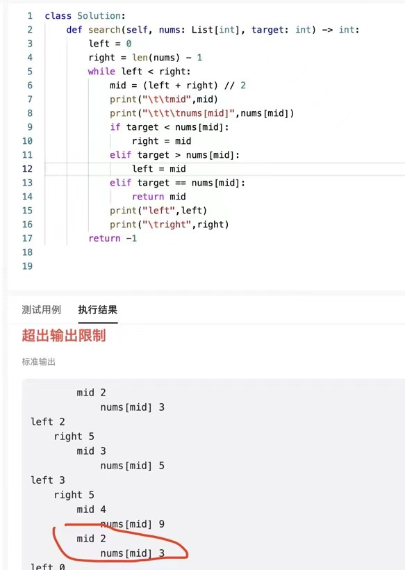
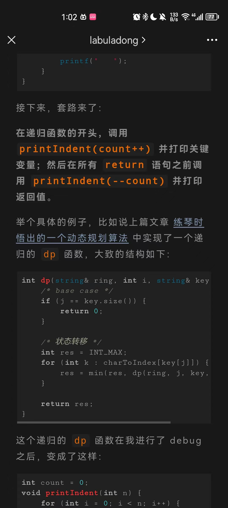

---
title: 递归debug 方法
date: 2023-03-30 00:38:35
modificationDate: 2023 三月 30日 星期四 00:38:39
categories: 
	- leetcode
tags: []
sticky: []
published: false
category_bar: true
---

使用tab 进行缩进
参考
[递归函数的Debug技巧 - 知乎 (zhihu.com)](https://zhuanlan.zhihu.com/p/369464796)
[分享一个小技巧，提高刷题幸福感 (qq.com)](https://mp.weixin.qq.com/s?__biz=MzAxODQxMDM0Mw==&mid=2247490945&idx=1&sn=03da23d366ad4577d2a22328f3ba04f9)






初始代码

```go
/**
 * Definition for a binary tree node.
 * type TreeNode struct {
 *     Val int
 *     Left *TreeNode
 *     Right *TreeNode
 * }
 */

func sumOfLeftLeaves(root *TreeNode) int {
	// 递归的输入和返回值是对的了
	res := 0
	// 终止条件
	if root == nil {
		return 0
	}
    leftNode := root.Left
	leftNodeVal := sumOfLeftLeaves(root.Left) // 左
    rightNodeVal := sumOfLeftLeaves(root.Right)// 右
	if leftNode != nil && leftNode.Left == nil && leftNode.Right == nil { // 中
		leftNodeVal = leftNode.Val
	}
	// 单次循环
    res  = leftNodeVal + rightNodeVal // 中，左边+右边
	return res 
}
```


```go
/**
 * Definition for a binary tree node.
 * type TreeNode struct {
 *     Val int
 *     Left *TreeNode
 *     Right *TreeNode
 * }
 */

import "fmt"
import "strings"
var count int = 0
func printIndent(n int) {
	re := strings.Repeat("|   ",n)
    fmt.Print(re)
}

func sumOfLeftLeaves(root *TreeNode) int {
	// 递归的输入和返回值是对的了
	res := 0
	// 终止条件
    
    printIndent(count)
    count += 1
    fmt.Println("loop start res:",res)
	if root == nil {
        count -= 1
        printIndent(count)
        fmt.Println("return1:",0)
		return 0
	}
    leftNode := root.Left
	leftNodeVal := sumOfLeftLeaves(root.Left) // 左
    rightNodeVal := sumOfLeftLeaves(root.Right)// 右
	if leftNode != nil && leftNode.Left == nil && leftNode.Right == nil { // 中
		leftNodeVal = leftNode.Val
	}
	// 单次循环
    res  = leftNodeVal + rightNodeVal // 中，左边+右边
    count -= 1
    printIndent(count)
    fmt.Println("left:",leftNodeVal,"+right:",rightNodeVal,"return2:",res)
	return res 
}

```

添加以下部分是可以缩进 递归debug 的。
```go
import "fmt"
import "strings"
var count int = 0
func printIndent(n int) {
	re := strings.Repeat("|   ",n)
    fmt.Print(re)
}
```

**结果**
