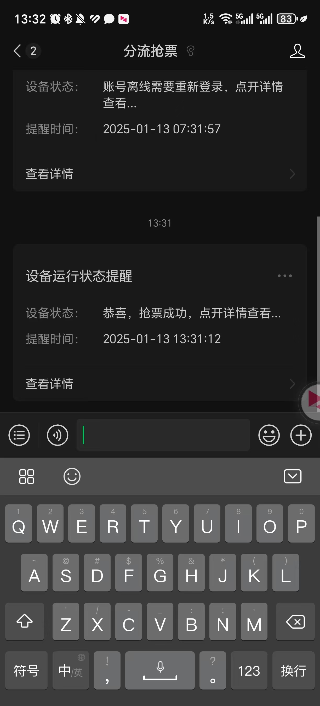

# 1. 下载分流抢票（windows) ，并安装

https://www.bypass.cn/

# 2.  登录，查询目标车票放票时间
需要注意的是，最好不要超过提前5小时来抢票，有可能会存在中途让你重新登录的情况，最稳妥的是在放票前10多分钟登录好，然后开始抢票。

# 3 先同步服务器时间

其他设置小黑屋设置为100秒/次。

# 4.设置微信通知
扫码绑定微信即可，绑定完成后可以测试一下效果。这个是起到通知作用，如果抢到了，我们收到通知后去12306付钱就行啦。当然你如果想更自动化一点，可以设置自动支付。

# 5.设置自动支付

绑定支付宝，抢到票自动支付。

# 6. 设置定时抢票提前两秒
时间间隔修改为200，设置更低的话IP容易被封（200我抢成功了），点击开始抢票！等待抢票成功吧！

# 抢到啦

